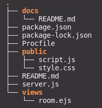

# Contributing to the-chill-room

The-chill-room welcomes contributors to this open source project on Github. When contributing, please follow our guideline.

## Motivation

This project is created based on curiosity as well as concern of a young engineer about the monetization of online applications. Intend to create a communication application that remains privacy of our users.

## Peer-to-peer in a server-client world

This application is built upon two main libraries [SocketIO](https://github.com/socketio/socket.io) and [PeerJS](https://github.com/peers/peerjs). PeerJS is served as peer-to-peer communication and socketIO is served as signaling server (at the current time, socketIO also servers messaging feature).

- PeerJS provides a complete, configurable and easy-to-use API build on top of WebRTC, supporting both data chanenels and media streams.
- Socket.IO enables real-time bidirectional event-based communication.

## Repository overview



1. ```package.json```
- Infomation about the project: name, git, dependencies

2. ```server.js``` 
- This is where all the magic of server-side happens

3. ```view``` directory
- Store the client-side

4. ```public``` directory
- Store assets file of client

5. ```Profile```
- This is a env file for the Heroku deployment

## Design


## About
- Owner: [thucngyyen](https://github.com/thucngyyen)
- Contributors: 
